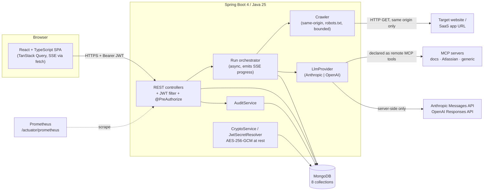
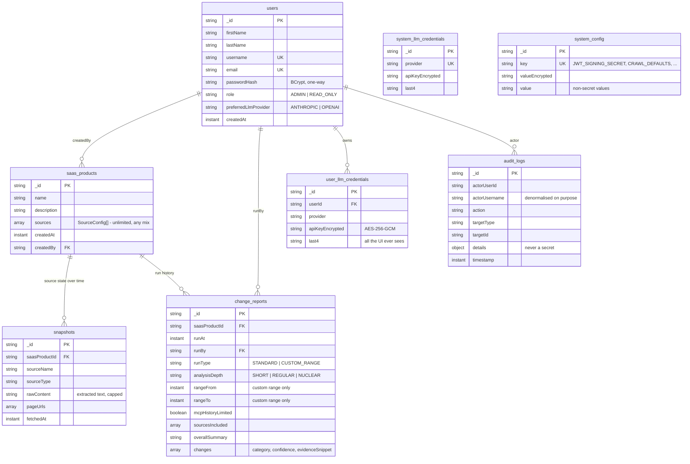
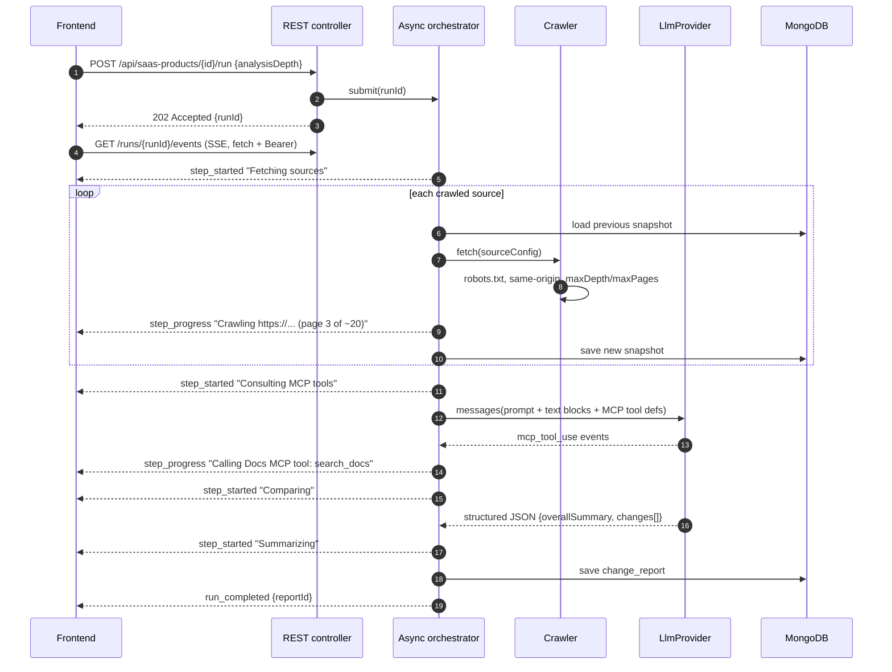

# Architecture

A living document: sections are filled in as each layer lands, and the *why* matters more here than the *what* — the
code and [`API.md`](API.md) describe shapes, this page explains choices you'd otherwise have to reverse-engineer.

## The one idea the whole system is built around

**There is no diffing logic in this codebase.** Nothing compares strings, computes similarity, or classifies a change
as a feature versus a pricing change. All of that is the LLM's job.

The backend's responsibilities are, in order of how much code they account for:

1. **Orchestration** — fetch every configured source, assemble one prompt, call a provider, persist what comes back.
2. **Access control** — who may see or run what.
3. **Observability** — what happened, when, on whose behalf, and how long it took.

That split is the reason a hand-written differ was rejected. "What changed that a human would care about" is a
judgement, not a computation: a reordered navigation menu is noise, one word changing in a retention policy is not,
and no amount of text-diff heuristics tells the two apart. The tradeoff accepted in exchange is real — results vary
between runs, and the same input at a different `analysisDepth` produces genuinely different output. That variance
is why every report stores the depth and provider it was produced with, and why `confidence` and `evidenceSnippet`
are per-change fields rather than an overall score: a reader needs to be able to check the model's work.

## System overview



Two things in that diagram are load-bearing:

- **MCP servers are reached by the *provider*, not by us.** MCP-typed sources are declared to the LLM as remote MCP
  tools; the model decides which tools to call. Crawled sources are the opposite — the backend fetches them and
  passes the extracted text inline. This is why MCP sources have no historical snapshots (see
  [Custom-range compare](#custom-range-compare-and-the-mcp-caveat)).
- **Provider calls are server-side only.** No API key ever reaches the browser. The frontend receives a masked
  `last4` at most.

## Data model

Eight collections. `snapshots` and `change_reports` are append-only in practice; nothing rewrites history.



Notes on choices that aren't obvious from the shapes:

- **`SourceConfig` is embedded in `saas_products`, not its own collection.** Sources have no identity or lifecycle
  outside the product that owns them, are always read together with it, and never number in the thousands. A
  separate collection would buy a join and nothing else.
- **`audit_logs.actorUsername` is denormalised.** Deleting a user must not erase the trail of what they did; a
  reference alone would leave dangling rows nobody can read.
- **`lastRun` is computed, never stored.** `GET /api/saas-products/{id}` derives it from the most recent
  `change_report`. Storing it would create a second source of truth that can disagree with the report it summarises.
- **Indexes are created explicitly** by `MongoIndexInitializer`, with `spring.data.mongodb.auto-index-creation=false`.
  Implicit index creation from annotations is convenient right up to the point where a production deployment builds
  an index nobody reviewed. Failure to create one logs a warning instead of aborting startup: the app works without
  an index, just slower, and refusing to boot turns a performance problem into an outage.

## A run, end to end



`detail` strings on those events are **real and specific** — the page actually being fetched, the MCP tool actually
being called. A generic "Thinking…" would make the live view decorative; the point of it is that a run taking two
minutes is legibly doing something rather than possibly hung.

The load-then-fetch-then-save order inside that loop is the one ordering in this application whose reversal leaves no
symptom. Save first and every source is compared against itself: the crawl runs, a report is written, the run counts
as a success, nothing throws — and every report says nothing changed, which is also what a correct report of a quiet
week says. There is no observation a user could make on one report to tell those apart, so it is pinned by an
`InOrder` assertion in `SourceFetcherTest` rather than left to a careful reader. The same reasoning applies one level
up in `RunOrchestrator`: the previous run's timestamp is read before this run's report is saved, because afterwards
"the previous run" would be this one and the model would be asked what changed since a moment that has not happened.

### Why async + SSE rather than a blocking request

A NUCLEAR-depth run over several sources can take minutes. A blocking POST would sit past proxy and load-balancer
idle timeouts, give the user no feedback, and lose everything on a dropped connection. `202 + runId` plus an event
stream costs one extra endpoint and makes the run observable, resumable-to-watch, and immune to the client going
away mid-run.

SSE is consumed with `fetch` and a streamed response body, not `EventSource`. `EventSource` can't set an
`Authorization` header, and the workaround — a token in the query string — puts credentials into access logs, proxy
logs, and browser history. `fetch` streaming is required anyway, because `/ask` is a POST.

### Custom-range compare, and the MCP caveat

`POST .../compare {fromDate, toDate}` reuses the same async/SSE/persistence plumbing but **never fetches or crawls
anything new** — it reads history that already exists. For crawled sources that's exact: the nearest snapshot
at-or-before each endpoint of the range. For MCP sources there is no historical state to read, because we never held
their content; the compare aggregates the `changes` from `change_report`s inside the range instead and sets
`mcpHistoryLimited: true` so the UI can say so rather than quietly presenting a weaker answer as an equal one.

### The report is durable; the narration is not

Everything a run says about itself lives in memory, in a `RunSession` held by `RunEventStream`. Nothing about the
live view is written to Mongo. Two consequences follow, and both are deliberate:

- **A run's event stream is only readable from the replica that is running it.** Behind more than one instance,
  `GET /runs/{runId}/events` has to reach the instance that answered the `POST`, so multi-replica deployments need
  sticky sessions for `/api/saas-products/*/runs/**` — noted again in [`DEPLOYMENT.md`](DEPLOYMENT.md). The
  alternative — a durable event log in Mongo, or a pub/sub fan-out — would add a collection and a cleanup job to
  make a progress bar survive a process restart that also killed the run it was narrating.
- **Narration expires; the report does not.** A finished run stays replayable for fifteen minutes so a reload or a
  second tab catches up, then the session is evicted and the stream 404s with a message pointing at the history
  timeline. Unfinished sessions are dropped after forty-five minutes, which is a leak-stopper rather than a feature:
  a session still open past that is a bug, and holding it forever would grow the heap for the life of the process.

Subscribing **replays** everything already emitted before attaching for what comes next. That is not a nicety: the
first crawl can finish before the browser has opened the stream, so without replay the common case would be a live
view that appears to start halfway through.

### Two thread pools, both bounded

Runs execute on one pool, questions on another — `RUN_CONCURRENCY` / `RUN_QUEUE_CAPACITY` and `ASK_CONCURRENCY`, all
in [`SETUP.md`](SETUP.md#prompt-and-concurrency-limits). The bound is a resource decision about *other people's*
resources: a run crawls somebody else's site and makes a metered model call, so accepting a hundred means a hundred
crawls and a hundred invoices. Past the queue the answer is `503` with "try again in a few minutes", which is honest;
an unbounded queue would hand back a `runId` for work that starts in half an hour, and the user would watch an empty
live view and conclude the feature is broken.

The split into two pools costs a handful of lines and prevents a failure with no error message: with one shared
queue, three concurrent nuclear runs would leave the query bar silently waiting behind twenty minutes of crawling.

## Security

### Stateless JWT, not server sessions

Sessions would need either sticky routing or a shared session store — infrastructure whose only job is to hold state
this app doesn't otherwise need. A signed JWT carries the identity and role, so any replica can serve any request.

The cost of statelessness is that you can't revoke one token. That's accepted, with one deliberate escape hatch:
**changing the signing secret invalidates every issued token at once.** That is how "sign everyone out" is
implemented, and it's why the Admin Console states plainly that setting or clearing the JWT override signs out
everyone including the admin doing it.

The signing secret resolves as: admin override (encrypted in Mongo) → `JWT_SECRET` → a 256-bit value generated on
first boot, encrypted, and persisted in `system_config`. It is emphatically **not** derived from the admin password —
see [`decisions/0001-jwt-signing-secret.md`](decisions/0001-jwt-signing-secret.md).

### Secrets at rest

LLM API keys, MCP `authToken`s, and the auto-generated JWT secret are AES-256-GCM encrypted under
`CREDENTIAL_ENCRYPTION_KEY` with a fresh random IV per value. The frontend never receives any of them — a masked
`last4` for keys, and for the JWT secret only its `configured`/`source` status, never a value. The audit log's
`details` object carries which fields changed, never what they changed to.

### Every secret resolves the same way

Three kinds of secret — LLM provider keys, the JWT signing secret, per-source MCP `authToken`s — and one shape of
answer for all of them:

**Admin Console override (encrypted in Mongo) → explicit external config (env var / properties / K8s Secret / ECS
secret) → automatic fallback.**

The override outranks the environment variable on purpose. An operator whose container was deployed with a key that
has since been rotated can fix it from the UI, without a redeploy and without shell access. The inverse order would
make the Admin Console's Secrets tab a form that appears to work and doesn't.

Two secrets are exceptions, structurally rather than by policy: `CREDENTIAL_ENCRYPTION_KEY` cannot be stored in
Mongo because it is what decrypts Mongo, and `MONGODB_URI` cannot because it is how Mongo is reached. Neither is
settable from the Admin Console, and no amount of UI work could change that.

[`credential/`](../backend/src/main/java/com/saasinvestigator/credential/) owns the provider-key half of this:

- **`user_llm_credentials`** — one key per user per provider (unique index), for the user who would rather spend
  their own quota. Keyed by `userId` rather than username, so a rename doesn't orphan a key.
- **`system_llm_credentials`** — at most one override per provider (unique index), set by an admin, spent on
  everyone's runs.
- **`HostCredentialLoader`** — the automatic fallback, reading `/run/host-credentials/anthropic-api-key` once at
  startup so `docker run -v ~/.anthropic-key:/run/host-credentials/anthropic-api-key:ro` is a working install.
  Anthropic only, because Anthropic is the system-wide default provider. Every failure mode — missing, a directory,
  4 KiB of the wrong file, unreadable, blank — logs and continues. Nothing about a credential file can stop the app
  from starting.
- **`ResolvedCredential`** — the one type that carries a plaintext key, handed straight to a provider SDK. Its
  `toString()` is overridden, because a record's generated one prints every component and this one ends up in log
  lines and debugger panes.

Nothing in `credential/` is cached. The JWT resolver caches for 15 seconds because it is consulted on *every
request*; a provider key is read once per run or ask, an operation already measured in seconds of LLM latency, so
caching it would buy nothing and cost "I pasted the new key and it still uses the old one on two of the three
replicas". Provider *selection* — whose key gets used for a given run — is not in this package; it belongs to
`llm/`.

MCP tokens follow the same shape one level down. `SourceConfig` stores only `authTokenEncrypted` and has no getter
that returns plaintext; [`SourceConfigMapper`](../backend/src/main/java/com/saasinvestigator/product/SourceConfigMapper.java)
is the single boundary — plaintext in from a request, ciphertext to Mongo, `last4` out to the API, and one
`decryptAuthToken` for the LLM layer to declare an MCP server with. On update an absent `authToken` means "leave it
alone", an empty one means "remove it", and anything else replaces it; see
[ADR 0006](decisions/0006-credential-resolution.md) for why that beats a sentinel string the client echoes back.

### Audit logging is explicit, not AOP

Every audited action is an explicit `AuditService.log(...)` call at the end of the relevant service method. An
aspect or annotation would be less code and worse: the interesting part of an audit entry is the *domain* context
(which user, which product, which fields), and an interceptor can only see method arguments. Explicit calls also
make it visible in review when a new mutating endpoint forgot to log one. Writing an audit entry can never fail a
request — a failure logs an error and leaves a gap, because the action itself already succeeded.

## Observability

Beyond the standard `http.server.requests` histogram, the app emits metrics about the thing it actually does:

| Metric | Type | Tags |
|---|---|---|
| `saas_run_total` | Counter | `product`, `status`, `runType`, `analysisDepth` |
| `saas_run_duration_seconds` | Timer (histogram, 1s–15m) | `product`, `runType`, `analysisDepth` |
| `saas_source_fetch_errors_total` | Counter | `product`, `sourceType` |
| `saas_ask_total` | Counter | `product`, `status` |

HTTP-layer metrics answer "is the service up." These answer the questions an operator of *this* app actually has:
are runs failing, which source type is flaky, is NUCLEAR depth worth what it costs in latency. `analysisDepth` is a
tag rather than a separate metric specifically so a latency regression can be attributed to depth mix rather than
looking like the app got slower.

`saas_run_duration_seconds` is configured as a **bounded percentile histogram, 1s to 15m**. The bounds are
load-bearing rather than tuning: Micrometer's default range is sized for HTTP requests (roughly 1ms–30s), so without
them every real run lands in the top bucket and every quantile reads as "30 seconds or more" regardless of how long
runs actually take. The other three are counters and have no buckets. None of the four exist in a scrape until the
first run or Ask — Micrometer registers a meter on first use, which on a dashboard is indistinguishable from
"everything is fine."

`/actuator/prometheus` is **intentionally unauthenticated** — scrapers don't carry JWTs. Restrict it at the
network/ingress layer, not in the app. This is called out again in [`DEPLOYMENT.md`](DEPLOYMENT.md), which also has
the per-tag meaning of each metric, example PromQL, and how to scrape it in each topology.

## Crawling is a safety boundary

`maxDepth` and `maxPages` are not only performance knobs. The crawler stays same-origin, respects `robots.txt`,
de-dupes visited URLs, enforces a per-page timeout, and caps total extracted text per source. A misconfigured
source must not be able to crawl unbounded — the blast radius of a typo in a URL should be a small useless report,
not a traffic incident on someone else's site.

Concretely, in [`crawl/`](../backend/src/main/java/com/saasinvestigator/crawl/):

- **Breadth-first, level by level**, with a per-crawl fixed thread pool of `app.crawler.concurrency` (4) held in a
  try-with-resources. The pool size *is* the concurrency bound, so there is no semaphore to misread. Unbounded
  sequential is slow; unbounded parallel is rude.
- **`maxDepth` counts hops from the starting URL.** `0` fetches only `endpointUrl`, `1` adds the pages it links to.
  Because the budget is spent in discovery order, the pages dropped at `maxPages` are the ones furthest from the
  start.
- **Ceilings nothing can raise** — `app.crawler.max-allowed-depth` (5) and `max-allowed-pages` (200). A per-source
  value or an Admin Console default above them is clamped; an admin *typing* one past them is rejected, because a
  form that silently stores 200 while showing 500 back is worse than an error.
- **Same origin is re-checked after redirects.** `HttpClient.Redirect.NORMAL` declines HTTPS→HTTP downgrades but
  cannot express "same origin only", so `response.uri()` is compared to the start origin once the redirect chain has
  settled. Scheme, host, and default-resolved port must all match.
- **Only renderable text is kept, and nothing editorial is dropped.** `script`/`style`/`svg`/`iframe` and friends are
  stripped; navigation and footers are *deliberately kept*, because a heuristic that drops a `<footer>` drops a
  pricing footnote. Pages are concatenated with `--- PAGE: <url> ---` headers so the model can attribute a change to
  a URL.
- **One page failing fails one page.** A 403, a timeout, a redirect off-origin, or a binary body is recorded in
  `CrawlResult.failures()` and reported as its own `step_progress`; the crawl carries on. `CrawlFailedException` is
  reserved for "this source produced nothing at all", which the orchestrator turns into one unavailable source in the
  report rather than a failed run.
- **The text cap truncates rather than empties.** At `max-chars-per-source` (200k) the crawl keeps the earliest pages
  and includes a *partial* final page when at least 2k characters fit. `CrawlResult.pageUrls()` lists only pages
  actually included — claiming coverage of a page whose text was dropped would be a lie told to whoever later asks
  why a change on it was missed.
- **An unreachable `robots.txt` refuses the crawl.** A 404 means "no rules, go ahead"; a 503 or a timeout means the
  rules are unknown, and proceeding would be crawling on an assumption. See
  [ADR 0005](decisions/0005-crawl-bounds.md).
- **Nothing in `crawl/` reads a secret.** A crawled source has no `authToken` in play — authenticated crawling would
  be a deliberate addition, not an accident of the token field existing on `SourceConfig` for the MCP types.

Crawl limits resolve in three layers, read per crawl so an Admin Console change takes effect without a restart:
the source's own `maxDepth`/`maxPages` → the `CRAWL_DEFAULTS` document in `system_config` → the shipped
`app.crawler.default-max-*` values. `CrawlSettings` owns that resolution and the clamping.

## Package layout

```
com.saasinvestigator
├── audit/          AuditAction, AuditLog, AuditService
├── common/         PageResponse — the one pagination envelope every list endpoint uses
├── config/         MongoIndexInitializer (explicit index creation)
├── crawl/          WebCrawler, RobotsTxt, CrawlSettings — URL in, text out, bounded
├── credential/     personal + system LLM keys, host-mount loader, resolution order
├── crypto/         CryptoService (AES-256-GCM, last4 masking)
├── error/          GlobalExceptionHandler, ApiErrorResponse, typed exceptions
├── llm/            LlmProvider abstraction and provider implementations
├── product/        SaasProduct, SourceConfig, SourceType — the unit of self-containment
├── report/         ChangeReport, Change, ChangeCategory, Confidence, AnalysisDepth, RunType
├── run/            orchestration, SSE sessions, the two thread pools, run metrics, /ask
├── security/       JWT issue/verify, secret resolution, filter, SecurityConfig
├── snapshot/       Snapshot — stored captures of crawled sources; the app's memory
├── systemconfig/   system_config access (encrypted and plain values)
└── user/           User model, service, controller, admin seeder
```

Packages are by feature, not by layer: `user/` holds its own model, repository, service, and controller. A
`controllers/` package that grows in lockstep with a `services/` package tells you nothing about what the app does.

### Configuration is asserted, not assumed

`ApplicationPropertiesBindingTest` reads every `META-INF/spring-configuration-metadata.json` on the classpath and
fails the build if any Spring-owned property in `application.properties` is one the current Boot version no longer
binds. It exists because of a bug this repo actually shipped for several build steps: Boot 4.0 renamed
`spring.data.mongodb.uri` to `spring.mongodb.uri` and removed the old name at deprecation level `error` — a level
that is **silently ignored rather than warned about**. The app booted, every query succeeded, and every document
went to Boot's default `mongodb://localhost/test` while `MONGODB_URI` did nothing at all.

Nothing else in the suite could have caught it. The Testcontainers tests use `@ServiceConnection`, which supplies
the connection programmatically and never reads the properties file; everything else mocks its repositories. A
property name that is wrong but well-formed is invisible to all of them, and to the running application. The check
is written against the shipped metadata rather than as an assertion about one known-good key, because renames of
this kind arrive as a batch on the next Boot upgrade.

## Frontend structure

```
frontend/src
├── api/            client.ts (the only place fetch is called), sse.ts, ApiError, queryClient + query keys
├── auth/           session.ts (token storage), AuthContext, route guards, LoginPage
├── components/     ErrorBoundary, toast provider, and the loading/empty/error state primitives
├── hooks/          useMediaQuery and the named breakpoints
├── layout/         AppLayout, Sidebar, TopBar, usePageTitle — the signed-in shell
├── pages/          one folder-level module per route, all lazy-loaded
├── styles/         tokens.css (the light/dark custom properties), global.css
├── theme/          ThemeProvider, ThemeToggle
└── test/           renderWithProviders and the shared fixtures
```

Five decisions here are worth knowing about, because each one looks arbitrary until it doesn't:

**All network access goes through `api/client.ts`.** It attaches the bearer token, and — more importantly — it
converts every failure into an `ApiError` carrying the backend's own `message` from `ApiErrorResponse`. A component
never sees a raw `TypeError` or an HTTP status, which is what makes "no raw error objects in the UI" enforceable
rather than aspirational. A transport failure becomes status `0`, so "the server is down" and "the server said no"
stay distinguishable.

**Token storage is React-free, in `auth/session.ts`.** `client.ts` needs the token and `AuthContext` needs the
client, so putting the token in the context would be a straight import cycle. Keeping it in a plain module also lets
the 401 handler be installed once, from the provider, without the client importing React at all.

**The theme is applied by an inline script in `index.html`, not by `ThemeProvider`.** An effect runs after the first
paint, so a dark-mode user would see exactly one white frame on every page load. `ThemeProvider` owns the
*subsequent* changes and the persisted preference; those ~12 duplicated lines buy the absence of a flash that no
amount of CSS can hide.

**Two error boundaries, deliberately.** The outer one in `App.tsx` catches a crash in the providers or the shell
itself. The inner one in `AppLayout` wraps only the routed page, keyed by pathname — so a page that throws leaves
the sidebar and top bar working, and navigating away clears the error instead of carrying it forward. Neither
catches async failures; those are already typed `ApiError`s surfaced inline by the page or as a toast.

**Inline for what the user just did, toast for everything else.** A failed form submission renders next to the
form, because that's where the user is looking and the message concerns the thing they were editing. A background
refetch failing, or a mutation whose result is off-screen, gets a toast. The one exception: a 401 never toasts —
the auth layer is already redirecting and explaining, and a second message about the same event reads as two
problems.

## Decisions

Short ADRs live in [`decisions/`](decisions/). Current:

- [0001 — JWT signing secret resolution](decisions/0001-jwt-signing-secret.md)
- [0002 — SSE authenticated via fetch, not EventSource](decisions/0002-sse-auth-via-fetch.md)
- [0003 — Jackson 3 for HTTP, Jackson 2 for LLM JSON](decisions/0003-jackson-2-and-3.md)
- [0004 — `confidence` is three levels, not a number](decisions/0004-confidence-as-three-levels.md)
- [0005 — Crawl bounds: depth semantics, hard ceilings, and an unreachable `robots.txt`](decisions/0005-crawl-bounds.md)
- [0006 — Credential resolution: override before env var, no `last4` for the JWT secret, no caching](decisions/0006-credential-resolution.md)
- [0007 — LLM providers: models, return types, callbacks, thinking, and depth mapping](decisions/0007-llm-providers.md)
- [0008 — The JWT is stored in `localStorage`, not an HttpOnly cookie](decisions/0008-jwt-in-localstorage.md)
