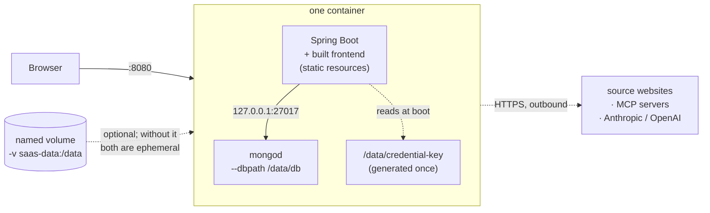
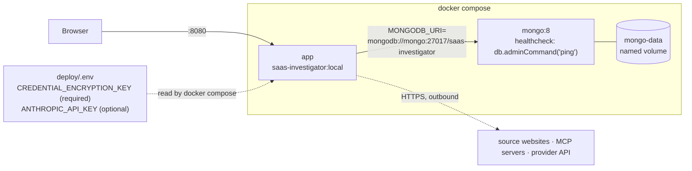
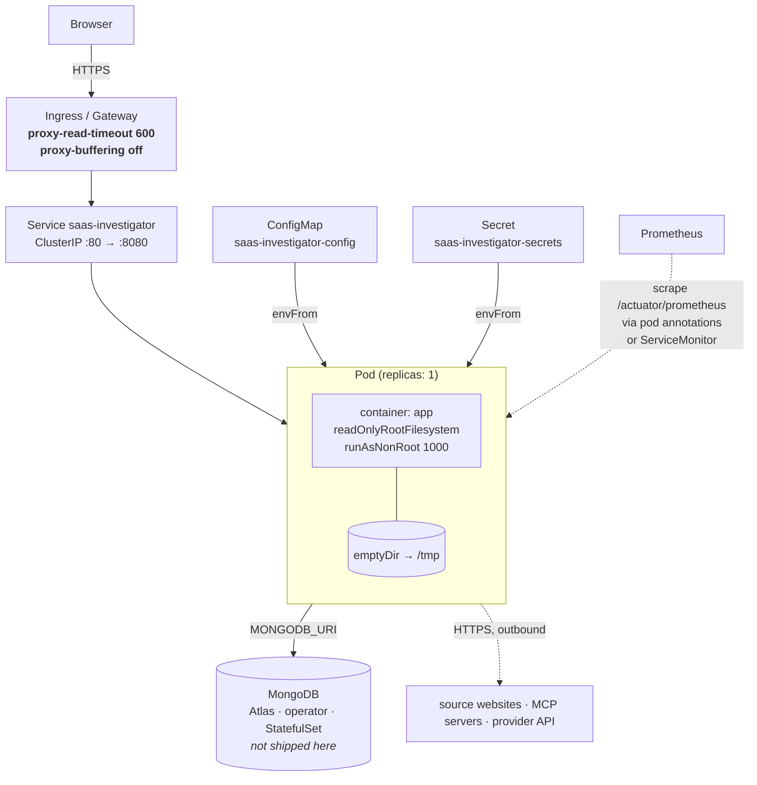
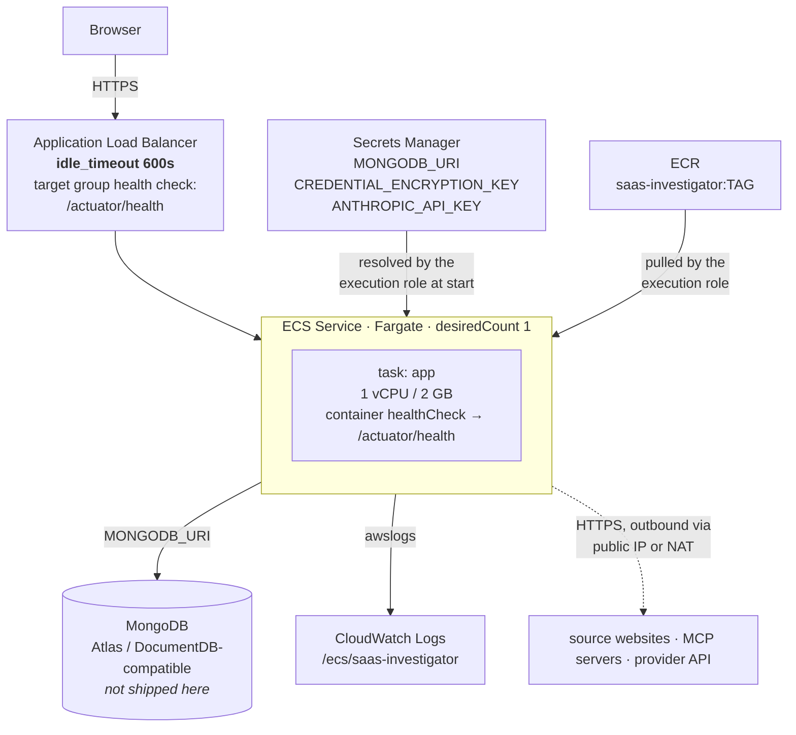

# Deployment

Four ways to run this, in increasing order of how much you have to decide: one container, two containers,
Kubernetes, ECS Fargate — plus the two Harness pipelines that build and roll out the first of those.

[`SETUP.md`](SETUP.md) is the reference for *what* every environment variable does. This page is about *where* they
come from in each topology, and about the handful of operational details that are specific to this app rather than
generic to running a Spring Boot image.

> **The image itself is BUILD ORDER step 11 and is not written yet.** Everything on this page describes the artifact
> that step produces — the multi-stage `Dockerfile` at the repo root — and the samples under [`/deploy`](../deploy/)
> and [`/harness`](../harness/) all reference it by name. Until that step lands, the manifests are readable and
> valid but there is no image to point them at; use the local dev loop in
> [`GETTING_STARTED.md`](GETTING_STARTED.md) instead.

---

## The three things that are specific to this app

Read these first. Each one has produced a confusing symptom in a topology that was otherwise configured correctly,
and each is repeated in context further down.

### 1. A run's live view only works on the replica running it

The step-by-step execution view is driven by Server-Sent Events from an in-memory `RunSession`. **Nothing about it
is written to MongoDB.** So `GET /api/saas-products/{id}/runs/{runId}/events` can only be answered by the instance
that answered the `POST` which started the run.

With two replicas behind round-robin routing, roughly half of all live-view subscriptions reach an instance that has
never heard of that `runId` and get a `404`. Users describe this as "the progress view randomly doesn't work."

Every sample here therefore ships **one replica**, and scaling past it requires session affinity at the layer that
actually chooses the backend — see [Scaling past one instance](#scaling-past-one-instance). The finished report is
durable and unaffected; it is only the narration that is instance-local. Background in
[`ARCHITECTURE.md`](ARCHITECTURE.md#the-report-is-durable-the-narration-is-not).

### 2. Anything in front of the app must tolerate a 10-minute streaming response

Run progress and streamed answers are SSE, `server.compression.enabled=false` and
`spring.mvc.async.request-timeout=600000` are set so a NUCLEAR-depth run can narrate itself for ten minutes, and a
proxy with a 60-second read timeout or response buffering on will cut that off mid-run. The app cannot report this,
because nothing failed on its side — the connection died.

| Layer | What to set |
|---|---|
| nginx-ingress | `nginx.ingress.kubernetes.io/proxy-read-timeout: "600"`, `nginx.ingress.kubernetes.io/proxy-buffering: "off"` |
| AWS ALB | `idle_timeout.timeout_seconds=600` on the load balancer (not the target group) |
| Cloudflare / similar | Confirm streaming responses are passed through, not buffered |

**Before blaming the proxy, check whether the body was actually complete.** A truncated stream and a *complete stream
that was never terminated* look identical in a browser — both log `ERR_INCOMPLETE_CHUNKED_ENCODING` — and only one of
them is an infrastructure problem:

```sh
curl -sS -N <stream-url> -H "Authorization: Bearer $TOKEN" -o /tmp/s.txt; echo "exit $?"
grep -c '^event:' /tmp/s.txt      # every event present, ending in run_completed?
```

Events missing from the middle or a body that stops mid-event is the proxy, and this section applies. **All** the
events present, ending in a well-formed `run_completed`, with `curl` still exiting 18, is an application-side framing
bug — that exact failure shipped here once, caused by an auth filter being skipped on the servlet ASYNC dispatch.
`troubleshoot-running-instance` has the diagnosis; no amount of proxy configuration will fix it.

### 3. Unset `MONGODB_URI` or `CREDENTIAL_ENCRYPTION_KEY` and the container invents its own

Both have container-local fallbacks so that a bare `docker run` is a complete working instance (see
[PACKAGING in SETUP.md](SETUP.md#container-fallbacks-and-where-the-line-is)). In every topology below those
fallbacks are **wrong**, and wrong quietly: each replica starts a private `mongod` and generates a private
encryption key, so what looks like one application is several disconnected ones, and on Fargate — where the task
filesystem is destroyed with the task — the whole database vanishes on every deploy with no error anywhere.

The `docker-compose`, Kubernetes and ECS samples all set both explicitly. The entrypoint prints a `WARNING` line
whenever it had to fall back; **that line appearing in a deployed environment's logs is the symptom**, and it is the
fourth step in the `troubleshoot-running-instance` skill for exactly that reason.

---

## Single container

The self-contained mode. One image, one port, no dependencies — an embedded MongoDB, a generated encryption key, an
auto-generated JWT signing secret, and `admin`/`admin` seeded.

```sh
docker build -t saas-investigator .
docker run -p 8080:8080 saas-investigator
```

That one port serves the UI *and* the API — the built frontend is a static resource inside the jar — so there is no
reverse proxy in the image and no CORS in play. Use `-p 80:8080` to reach it at `http://localhost/` instead; the
container still listens on 8080 either way. See
[Ports, and why there is no reverse proxy](SETUP.md#ports-and-why-there-is-no-reverse-proxy) for why an in-image
NGINX would cost you the SSE progress stream, and why TLS and hostnames belong to the Ingress/ALB layer below.



Add `-v saas-data:/data` to keep the database and the generated key across container recreation. They live under one
directory on purpose: mount it and both persist together, mount nothing and both are lost together, so there is
never a mismatch where an encryption key outlives the data it was protecting or vice versa.

**Where the line is.** This is a real instance, not a toy — but it is single-container and single-instance, and it
cannot be scaled, because a second replica would boot its own disconnected database. Everything below exists for the
case where that isn't enough. The four `docker run` variants (bare, bare with a volume, fully explicit, and the
host-mounted key file) are enumerated in [`SETUP.md`](SETUP.md#fully-containerised).

Rotate the default admin password before this is reachable by anyone but you. The app logs a loud multi-line warning
on the boot that seeds it.

---

## docker-compose — app plus a separate database

[`deploy/docker-compose.yml`](../deploy/docker-compose.yml). The first topology where the app and its database
restart independently.

```sh
cp deploy/.env.example deploy/.env
printf 'CREDENTIAL_ENCRYPTION_KEY=%s\n' "$(head -c 32 /dev/urandom | base64)" >> deploy/.env

docker compose -f deploy/docker-compose.yml up --build      # the whole stack
docker compose -f deploy/docker-compose.yml up -d mongo     # just the database, for the local dev loop
```



Two deliberate details in that file:

- **`CREDENTIAL_ENCRYPTION_KEY` uses `${VAR:?}`**, so compose refuses to start without it rather than letting the
  container generate one. A compose stack has a real named volume that outlives the app container — a generated key
  that doesn't is precisely the mismatch that makes stored API keys unreadable after a `docker compose down`.
- **`JWT_SECRET` is omitted.** Unset, the app generates one on first boot and persists it encrypted, so
  `docker compose restart` does not sign everyone out.

`up mongo` on its own builds nothing else, which is why [`GETTING_STARTED.md`](GETTING_STARTED.md) checkpoint 2 can
use it before the app image exists.

---

## Kubernetes

[`deploy/k8s/`](../deploy/k8s/) — four manifests, all with placeholder values, validated against upstream
Kubernetes schemas but **not** applyable as-is.

```sh
# Replace YOUR_REGISTRY and the CHANGEME secrets first.
kubectl apply -f deploy/k8s/configmap.yaml
kubectl apply -f deploy/k8s/secret.yaml
kubectl apply -f deploy/k8s/deployment.yaml
kubectl apply -f deploy/k8s/service.yaml

kubectl port-forward svc/saas-investigator 8080:80
curl localhost:8080/actuator/health        # {"groups":["liveness","readiness"],"status":"UP"}
```

| File | What it holds | Why it's separate |
|---|---|---|
| [`configmap.yaml`](../deploy/k8s/configmap.yaml) | Model names, the two concurrency pools, the prompt budget, token lifetime | Everything safe to read from `kubectl get configmap -o yaml`. Spelled out rather than left to compiled-in defaults, because an env var you can `kubectl edit` is a knob and a default in a jar is not. |
| [`secret.yaml`](../deploy/k8s/secret.yaml) | `MONGODB_URI`, `CREDENTIAL_ENCRYPTION_KEY`, `ANTHROPIC_API_KEY` | A Secret is base64, not encryption — worth having as its own object because it can be separately RBAC-restricted and audited, not because the contents are protected. |
| [`deployment.yaml`](../deploy/k8s/deployment.yaml) | One replica, three probes, resources, Prometheus scrape annotations, hardened `securityContext` | — |
| [`service.yaml`](../deploy/k8s/service.yaml) | `ClusterIP` on port 80 → container 8080, plus commented-out affinity and a `ServiceMonitor` | `ClusterIP` because TLS, hostname, and who may reach it are decisions a sample can't make. Put an Ingress or Gateway in front. |



### No database manifest, on purpose

There is no MongoDB StatefulSet here. Running a database is a decision with an owner — backups, storage class,
upgrades, replica-set topology — and a sample StatefulSet with none of those is worse than no sample, because it
looks production-shaped and isn't. Point `MONGODB_URI` at Atlas, at an operator-managed replica set, or at something
you run deliberately.

### Probes: the distinction that matters

Three probes, three jobs, and the split is not cosmetic:

| Probe | Path | Includes MongoDB? |
|---|---|---|
| `startupProbe` | `/actuator/health/readiness` | yes — ~2 min budget for JVM boot, index verification, admin-seed check |
| `livenessProbe` | `/actuator/health/liveness` | **no** — JVM state only |
| `readinessProbe` | `/actuator/health/readiness` | yes |

Readiness includes the MongoDB health indicator; liveness does not. A database blip should take the pod out of the
Service until Mongo returns — it should **not** restart the JVM, which fixes nothing and kills every in-flight run.
Pointing both probes at `/actuator/health` (which aggregates everything, Mongo included) is the common version of
this mistake, and it turns a five-minute database outage into `CrashLoopBackOff`.

All three paths are exposed and unauthenticated; `management.endpoints.web.exposure.include=health,prometheus`
limits `/actuator` to those two endpoints.

### `readOnlyRootFilesystem` works here only because both secrets are set

The pod mounts an `emptyDir` at `/tmp` (the JVM writes `hsperfdata` at startup) and has **no** volume at `/data`.
That is what makes a read-only root filesystem safe: the entrypoint only touches `/data` to start an embedded
`mongod` or generate an encryption key, and the Secret supplies both values so neither fallback runs. Omit either
one and the pod fails immediately trying to `mkdir /data/db` — which is the correct outcome, because the
alternative is a replica quietly running its own private database.

### Scaling past one instance

`replicas: 1` is a constraint, not a starting value — see [the first note above](#1-a-runs-live-view-only-works-on-the-replica-running-it).
Raising it needs affinity at the layer that picks the backend:

1. `sessionAffinity: ClientIP` on the Service (commented out in `service.yaml`) — **but** if an ingress controller
   proxies traffic, the "client IP" the Service sees is the controller's pod IP, so every user looks like one client
   and affinity pins them all to a single replica. That is not load balancing.
2. In that setup, affinity has to be configured on the ingress instead — a cookie on nginx-ingress, consistent
   hashing elsewhere — scoped at minimum to `/api/saas-products/*/runs/**`.

The rollout strategy is `maxSurge: 0` / `maxUnavailable: 1` for the same reason: at one replica, a surge-1 rollout
briefly runs two pods, and a live view opened against one while the run started on the other is the same `404`.
A few seconds of downtime per deploy is the cheaper trade until affinity is configured.

Nothing else blocks horizontal scaling. The JWT is signed rather than stored, and its signing secret is resolved
from the database, so every replica agrees on it.

---

## ECS Fargate

[`deploy/ecs/`](../deploy/ecs/) — [`task-definition.json`](../deploy/ecs/task-definition.json) and a short
[`service.json`](../deploy/ecs/service.json), both with placeholder ARNs. JSON has no comments, so the notes live in
`_comment*` keys; the ECS API ignores unknown members, but strip them if your tooling validates strictly.

```sh
aws ecs register-task-definition --cli-input-json file://deploy/ecs/task-definition.json
aws ecs create-service --cli-input-json file://deploy/ecs/service.json
# subsequent deploys:
aws ecs update-service --cluster YOUR_ECS_CLUSTER --service saas-investigator \
  --task-definition saas-investigator --force-new-deployment
```



### What the task definition assumes already exists

Registering a task definition creates none of these, and three of the four are the usual reason a first task stops
before the application logs a line:

| Assumed | Why it matters |
|---|---|
| An ECR repository with the image | Pinned by tag. `:latest` gives you a deployment you can't reproduce. |
| **Two** IAM roles, not one | `executionRoleArn` is used by the ECS agent *before the container starts*, to pull the image and resolve the secrets; without `secretsmanager:GetSecretValue` on those exact ARNs the task stops during provisioning with `ResourceInitializationError` and no application logs at all. `taskRoleArn` is what the running process uses — and this app needs nothing from AWS at runtime, so it can carry an empty policy. Merging them hands the application read access to every secret the execution role can reach. |
| A Secrets Manager secret per sensitive value | The `-AbCdEf` suffix AWS appends is part of the ARN; copy it rather than constructing the ARN by hand. |
| The CloudWatch log group `/ecs/saas-investigator` | `awslogs` does not create it unless you add `"awslogs-create-group": "true"` and grant `logs:CreateLogGroup`. Otherwise the task fails in the logging driver — and so has nowhere to say so except the stopped-task reason. |
| A cluster, VPC subnets, a security group, an ALB target group | `service.json` references them; creating them is a networking decision with an owner. |

### Two ECS-specific gotchas

**The container health check needs `curl` inside the image.** It runs in the container, not from outside, so a
missing binary makes the check fail forever and ECS responds by killing a healthy task on a loop. The final image
stage is Debian-based (MongoDB's server binaries need glibc), which makes `curl` likely but not guaranteed —
verify before relying on it:

```sh
docker run --rm --entrypoint sh saas-investigator -c 'command -v curl || command -v wget'
```

**ECS has one health check where Kubernetes has two.** `/actuator/health` aggregates MongoDB, so a database blip
makes ECS *replace* the task — killing in-flight runs to fix nothing. If that trade is wrong for you, point the
container check at `/actuator/health/liveness` (JVM only) and leave the Mongo-aware check to the ALB target group,
where failing merely removes the task from rotation.

`desiredCount: 1` for the live-view reason above; scaling past it needs `stickiness.enabled=true` with
`stickiness.type=lb_cookie` on the target group.

---

## Observability

### Metrics

`/actuator/prometheus` exposes Micrometer's standard HTTP metrics plus four the application registers itself. The
names below are the ones Prometheus publishes — **not** the names in the code, which are dotted and carry no
`_total`, because the Prometheus registry rewrites both. `RunMetricsTest` asserts the published names against a real
`PrometheusMeterRegistry`, so a Micrometer upgrade that changes a naming convention breaks a test rather than a
dashboard.

| Series | Type | Tags | What it answers |
|---|---|---|---|
| `saas_run_total` | counter | `product`, `status` (`success` \| `partial` \| `failure`), `runType` (`STANDARD` \| `CUSTOM_RANGE`), `analysisDepth` (`SHORT` \| `REGULAR` \| `NUCLEAR`) | Are runs succeeding? `partial` means the run produced a report but at least one source couldn't be read. |
| `saas_run_duration_seconds` | histogram — `_bucket`, `_count`, `_sum`, `_max` | `product`, `runType`, `analysisDepth` | How long runs take, and whether a latency change is a real regression or just a shift in depth mix. |
| `saas_source_fetch_errors_total` | counter | `product`, `sourceType` | Which *kind* of source is flaky — crawled sources failing points at the network or a target site, MCP sources failing points at a credential or an unreachable server. |
| `saas_ask_total` | counter | `product`, `status` (`success` \| `failure`) | Ad-hoc questions, by outcome. |

Two things to know before building a dashboard on these:

**They don't exist until something happens.** Micrometer registers a counter on first increment, so a freshly
started instance publishes none of the four. On a dashboard that is indistinguishable from "everything is fine";
alert on `absent()` deliberately or not at all, and don't read an empty graph as a healthy one.

**`saas_run_duration_seconds` is a bounded histogram, 1s to 15m, 46 buckets.** The bounds are load-bearing:
Micrometer's default range is sized for HTTP requests (roughly 1ms–30s), so without them every real run lands in the
top bucket and every quantile reads as "30 seconds or more" regardless of how long runs actually take. Cardinality
is 46 series per `product` × `runType` × `analysisDepth` combination, which is the main cost of these metrics —
tolerable for a tool whose products are created by hand in the dozens, worth re-checking if that stops being true.
`product` is deliberately the product's *name* rather than its id, because a Mongo ObjectId on a graph tells an
operator nothing.

```promql
# run success rate, last hour
sum(rate(saas_run_total{status="success"}[1h])) / sum(rate(saas_run_total[1h]))

# p95 run latency by depth - needs the _bucket series, hence the bounded histogram above
histogram_quantile(0.95, sum by (le, analysisDepth) (rate(saas_run_duration_seconds_bucket[1h])))

# which source type is failing
sum by (sourceType) (rate(saas_source_fetch_errors_total[1h]))
```

> A property-name trap worth knowing if you add another distribution setting: these filters are keyed by the
> *Micrometer meter name* (`saas.run.duration`), not the published series name (`saas_run_duration_seconds`). A key
> that matches no meter binds successfully and does nothing — no warning, no error, just a timer that silently keeps
> publishing as a summary with no buckets. This repo shipped exactly that from step 7 until step 12;
> `RunMetricsDistributionPropertiesTest` now fails on it.

### How to scrape it

- **Plain Prometheus**: the pod template in `deployment.yaml` carries `prometheus.io/scrape`, `prometheus.io/path`
  and `prometheus.io/port` annotations for the standard `kubernetes_sd` pod-annotation relabeling.
- **Prometheus Operator**: uncomment the `ServiceMonitor` in `service.yaml` **and delete those annotations** —
  running both means the same series ingested twice under different job labels, which quietly doubles every `rate()`
  on a dashboard. The `release` label on the `ServiceMonitor` must match your Prometheus's selector; find it with
  `kubectl get prometheus -A -o jsonpath='{..serviceMonitorSelector}'`.
- **ECS**: no annotation mechanism. Use the ADOT sidecar, or a Prometheus with ECS service discovery pointed at the
  task's port 8080.

A 30s interval is plenty. These metrics only change when somebody clicks Run.

### `/actuator` is unauthenticated by design

`SecurityConfig` permits `/actuator/**` without a JWT, because scrapers and kubelets don't carry one. This is a
deliberate trade, and the mitigation is **network-layer, not app-layer**:

- Kubernetes: a `NetworkPolicy` admitting only your monitoring namespace to port 8080 for that path, or a separate
  management port not exposed by the Service.
- ECS: a security group admitting only the load balancer, with `/actuator/*` not routed by any ALB rule.

`management.endpoint.health.show-details=never`, so the public health endpoint returns a bare status and leaks
nothing about component internals. `/actuator/prometheus` does expose **product names** as metric tags — if those
are sensitive, that alone is reason to restrict it. The detailed, component-by-component health view is
`GET /api/admin/health`, which is admin-only.

### Logs worth alerting on

| Log line | Means |
|---|---|
| `WARNING: no MONGODB_URI set - started an embedded local MongoDB` | The pod/task is running a private throwaway database. Its data dies with the container. |
| `WARNING: no CREDENTIAL_ENCRYPTION_KEY set - generated one` | Everything encrypted from now on becomes unreadable when this container is recreated. |
| `DEFAULT ADMIN CREDENTIAL CREATED` (multi-line) | An empty `users` collection was just seeded with `admin`/`admin`. Expected exactly once, on a genuinely new database — at any other time it means the app is talking to a database that isn't the one you think. |

The first two are entrypoint output; all three appear at startup.

---

## CI/CD: the Harness pipelines

Two samples in [`/harness`](../harness/). Both consume what already exists — the `Dockerfile` at the repo root and
the manifests in `/deploy/k8s` — rather than describing the build a second way. Neither runs unmodified: every
`YOUR_*` is a placeholder for something that must exist in your Harness account first.

### [`ci-build-pipeline.yaml`](../harness/ci-build-pipeline.yaml) — tests, then an image

Tests run *before* the build step, and that ordering is the entire point. `docker build` in this repo runs
`mvn package -DskipTests` and never executes a test, deliberately, so that the quick-start path works regardless of
test state (see [TESTING in SETUP.md](SETUP.md#docker-build-and-docker-run-never-run-tests--by-design)). The
consequence is that the Dockerfile is not a quality gate. This pipeline is where that gate lives: a red suite fails
the pipeline and no image is pushed.

### [`build-and-deploy-k8s-pipeline.yaml`](../harness/build-and-deploy-k8s-pipeline.yaml) — the same build, then a rollout

Adds a Deployment stage that rolls the just-built image out with the `/deploy/k8s` manifests: `K8sDryRun`, then
`K8sRollingDeploy`, with `K8sRollingRollback` as the rollback step.

The division of labour is the thing to understand before editing it. **The pipeline is the sequencing.** Where the
cluster is, which namespace, which manifests, and which values override them all live in the Harness Service and
Environment — configured once in Harness, referenced here by identifier. Inlining them would give you two places
describing the same cluster and no way to promote one artifact through staging and production.

### Placeholders, and what each becomes

| Placeholder | What it needs to be | In which pipeline |
|---|---|---|
| `YOUR_PROJECT_ID` / `YOUR_ORG_ID` | The Harness project and org the pipeline lives in. | both |
| `YOUR_CODE_REPO_CONNECTOR` | A code repo connector (GitHub/GitLab/Bitbucket) with read access to this repository. | both |
| `YOUR_K8S_BUILD_INFRA_CONNECTOR` | A Kubernetes connector to a cluster Harness may run **build pods** in, with the namespace (`harness-builds`) existing. Unrelated to the deploy target. Swap the whole `infrastructure` block for Harness Cloud if you'd rather not supply build infrastructure. | both |
| `YOUR_DOCKER_HUB_CONNECTOR` | A registry connector used only to **pull** the `maven:3.9-eclipse-temurin-25` and `node:20` step images. | both |
| `YOUR_DOCKER_REGISTRY_CONNECTOR` | A registry connector with **push** rights. | both |
| `YOUR_REGISTRY/saas-investigator` | The repository to push to — the same one `deploy/k8s/deployment.yaml` and the ECS task definition pull from. | both |
| `YOUR_HARNESS_SERVICE` | A Harness **Service**: manifest source = this repo's `/deploy/k8s`, artifact source = the registry repository above. | deploy only |
| `YOUR_HARNESS_ENVIRONMENT` | A Harness **Environment** (dev/staging/prod). | deploy only |
| `YOUR_INFRA_DEFINITION` | An **Infrastructure Definition** inside that Environment, naming the target cluster connector and namespace. This is where the deploy target lives — not in the pipeline file. | deploy only |

### Two things to get right when wiring the Service

**Use `<+artifact.image>` for the image field.** The Service's manifest source points at `/deploy/k8s`, where
`deployment.yaml` has a placeholder image. Harness substitutes the artifact it resolved — but only if the Service's
manifest or values override uses `<+artifact.image>` there. Miss it and every rollout deploys the literal
`YOUR_REGISTRY/saas-investigator:1`.

**Do not include `secret.yaml` in the Service's manifest list.** It holds `CHANGEME` placeholders. Real secrets
belong in your secret manager, referenced through Harness secrets or applied out of band. Including that file means
a deploy overwrites working credentials with the string `CHANGEME` — and because the app treats undecryptable values
as unset, the symptom is "all our API keys vanished," not an error.

### Two caveats on the pipelines themselves

**The backend test step needs a reachable Docker daemon.** Some tests start a real MongoDB with Testcontainers,
because the queries they cover prove nothing against a mock, and they fail rather than skip when no daemon is found
(a silently skipped test reporting as a pass is worse than a red build). On `KubernetesDirect` that means either a
Docker-in-Docker background step or a mounted host socket — both cluster-policy decisions, so neither is assumed in
the sample. Harness Cloud provides one out of the box. Excluding those tests to get a green pipeline would delete
the only coverage of the Mongo query layer.

**A rollback does not roll back MongoDB.** `K8sRollingRollback` reverts the Deployment to its previous revision.
Anything a release changed in stored data is not undone — and neither is a `CREDENTIAL_ENCRYPTION_KEY` change, which
makes every value encrypted since unreadable. See the `rotate-secrets` skill before changing that one.

### There is no coverage gate yet

JaCoCo is bound to the Maven `test` phase and produces a report, but `jacoco:check` is not wired in — deferred
deliberately, not forgotten. Turning it on is the `enable-coverage-gate` skill, which changes `mvn test` to
`mvn verify` in the pipeline's test step. That one word is what makes a threshold actually gate CI; the Dockerfile
still never touches any of it.

---

## Adding another target

The `add-deployment-target` skill is the checklist: what's environment-specific versus shared, where samples live,
what this page needs updated, and whether the deploy pipeline needs a parallel one for the new target.
